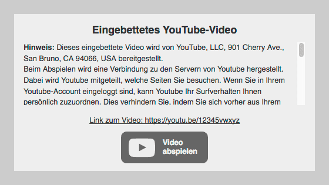

# DSGVO Video-Embed

Einfache Zwei-Klick-Lösung zur DSGVO-konformen Einbettung von YouTube- und Vimeo-Videos.



Dieses Skript ersetzt alle eingebetteten Videos von YouTube und Vimeo durch den Hinweis, dass es sich um eingebettete Videos handelt, welche beim Abspielen Daten an den Video-Betreiber senden. Es wird ein externer Link zum Video auf der Betreiberseite angezeigt sowie ein Button, mit dem das Video trotzdem eingebettet abgespielt werden kann.  
Normal eingebettete YouTube-Videos werden durch solche mit „erweitertem Datenschutzmodus“ ersetzt.

## How-To

Einfach `dgsvo-video-embed.css` und `dgsvo-video-embed.js` in das `<head>` Element einfügen und fertig!

*Hinweis:* Das Skript sollte wirklich in das `<head>` Element eingefügt werden und nicht (wie auch üblich) vor den schließenden `<body>`-Tag, da die `iframes` sonst nicht rechtzeitig vom Verbindungsaufbau zu YouTube bzw. Vimeo abgehalten werden können!

```html
<head>
  …
  <link rel="stylesheet" href="dgsvo-video-embed.min.css">
  <script src="dgsvo-video-embed.min.js"></script>
</head>
```

## Konfiguration

Das Skript ist jeweils mit einem Standard-Text für YouTube und Vimeo ausgestattet. Wer damit zufrieden ist, muss gar nichts ändern!

Wer den Text jedoch ändern will, findet ihn am Anfang der Datei `js/dgsvo-video-embed.js` (oder auch `js/dgsvo-video-embed.min.js`):

```javascript
// Config
var text = {
  youtube: "<strong>YouTube-Video</strong>",
  vimeo: "<strong>Vimeo-Video</strong>"
}
```

Natürlich kann dieser Text beliebig verändert werden (wie das CSS auch). Wenn man jedoch nur inhaltliche Anpassungen vornehmen will, kann man sich an das vorhandene HTML-Gerüst halten:

```html
<strong>Titel</strong>
<div>
    <p><b>Hinweis:</b> Text</p>
</div>
<a class="video-link" href="https://youtu.be/%id%">Link</a>
<button>Video abspielen</button>
```

Der Platzhalter `%id%` wird durch die Video-ID ersetzt.  
Das Element `<button>` wird mit einem Eventlistener versehen, der den Platzhalter wieder mit dem ursprünglichen `<iframe>` ersetzt.

## Rechtlicher Hinweis / Disclaimer

Der Autor dieses Skripts ist kein Jurist und bietet das Skript frei von jeder Haftung an. Wer Videos einbettet, wird hierzu auf jeden Fall einen eigenen Abschnitt in die Datenschutzerklärung der eigenen Website aufnehmen müssen. Ob der Einsatz dieses Skriptes vollkommen rechtssicher ist, kann nicht garantiert werden.

*Der Gebrauch erfolgt auf eigenes Risiko!*
